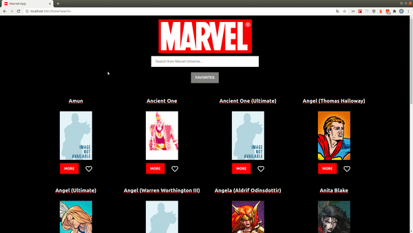

# My Custom Giphy Application

## 📺 Demo

You can test the application [here](https://marvel-api-project.netlify.app)

## 🚀 Purpose of the Project

This Project was created to improve my coding experience with an API.



And it's responsive


## ⚒ What the Application can do :

- The app list all the heroes afrom the Marvel API
- The user can search heroes using the searchbar
- The user and copy/paste the url from search
- The user can add or remove heroes to his favorit
- His Favorites are saved in LocalStorage
- Can be use on phone

## 🦾 Technical Stack

- [Create React App](https://github.com/facebook/create-react-app)
- [Styled Component](https://styled-components.com/)
- [Jest](https://jestjs.io/)

## ❓ How to start the Project

### ⚙️ Install

1. First of all you need to clone the repostory into a local folder

2. Then you have to install the dependencies by typing in your terminal :

```sh
$ npm i
```

3. You will need to create an api key [here](https://developer.marvel.com/docs) to get access to the API from [MARVEL](https://developer.marvel.com/)

4. Once you have the key, create `.env` file in the root of the project.

5. Open the `.env` file and add your key after : `REACT_APP_MARVEL_API_KEY`.  
   You should have something like : `REACT_APP_MARVEL_API_KEY=zda5451515az14e5569`.

### 🦸‍♂️ Run

Everything is good now just run the project by typing in your terminal : npm start

---

### 👨‍💻 Available Scripts

In the project directory, you can run:

#### `npm start`

Runs the app in the development mode.  
Open [http://localhost:3000](http://localhost:3000) to view it in the browser.

The page will reload if you make edits.  
You will also see any lint errors in the console.

#### `npm test`

Launches the test runner in the interactive watch mode.  
See the section about [running tests](https://facebook.github.io/create-react-app/docs/running-tests) for more information.

#### `npm run build`

Builds the app for production to the `build` folder.  
It correctly bundles React in production mode and optimizes the build for the best performance.

The build is minified and the filenames include the hashes.  
Your app is ready to be deployed!

See the section about [deployment](https://facebook.github.io/create-react-app/docs/deployment) for more information.
